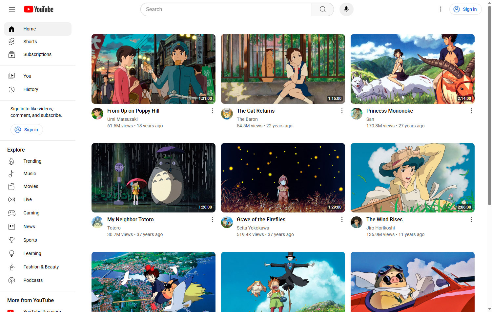
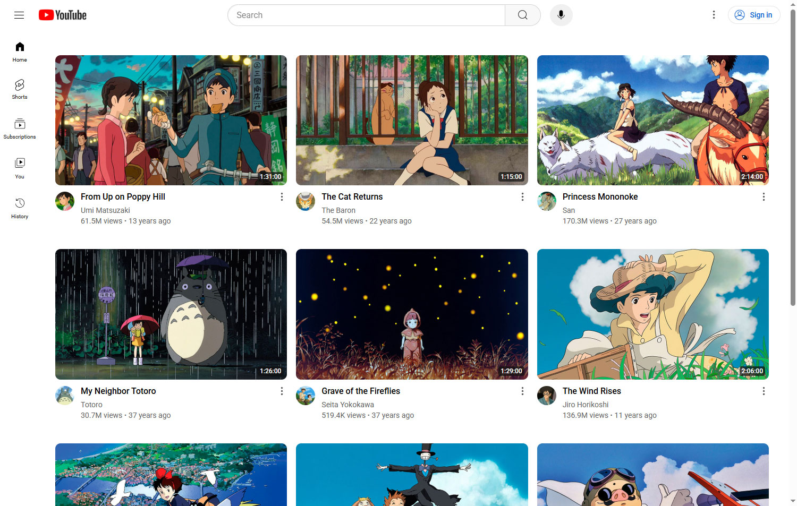
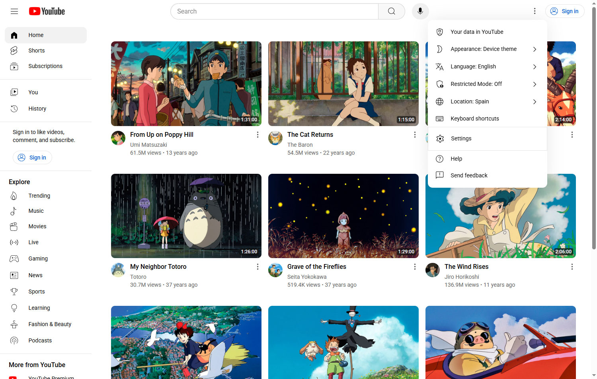
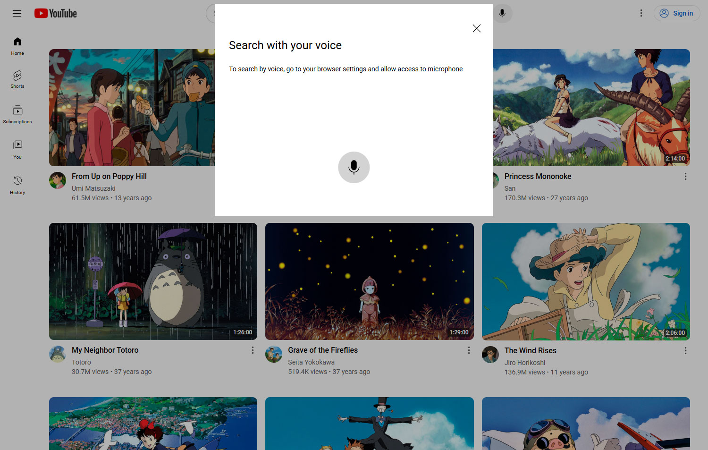
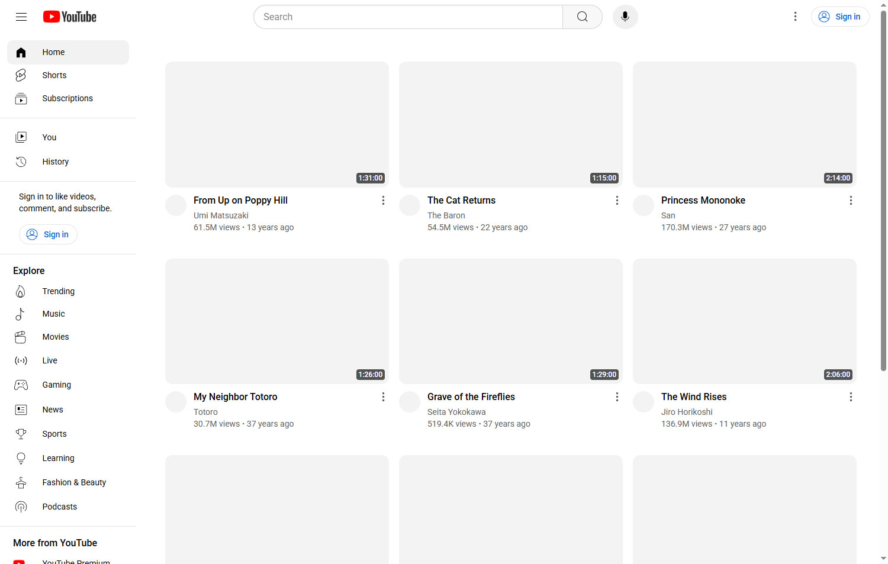
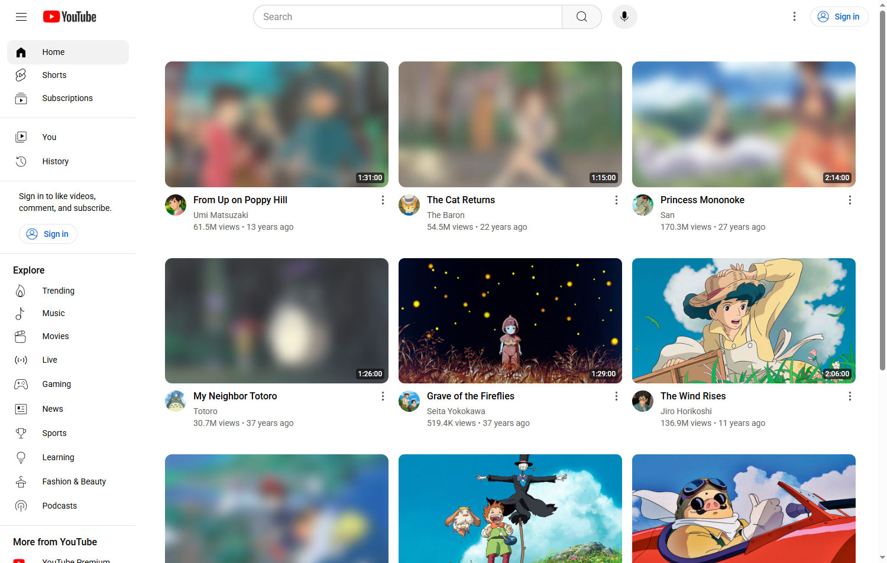

# 📺 YouTube Clone – A Vanilla JavaScript Modular App



## 📋 About

Built with a strong focus on **responsiveness** and **accessibility**, the current [YouTube Clone](https://youtube-clone1.pages.dev/) has been developed using **vanilla JavaScript** and a clean **modular architecture**. It thoughtfully combines procedural and functional programming techniques to keep the codebase simple, modular, and maintainable. Featuring videos containing information about Studio Ghibli movies.

It replicates the core UI and UX components of YouTube’s homepage, including:

- 🎞️ Video cards  
- 📂 Interactive side and top menus  
- 💬 Accessible modals  
- 🎙️ Voice search interaction  

This project shows practical coding skills without using heavy frameworks. It highlights a strong understanding of core JavaScript and good web development practices.

### 🌟 Acknowledgements

This project draws inspiration from several sources that helped shape its development:

- Several **YouTube tutorials**, **forums**, and online documentation, such as **W3Schools** and **MDN**, provided valuable insights, covering everything from technical documentation to modern accessibility, security, and deployment practices.

<br>

## 🚀 Features

- 🏗️  **Modular Architecture:** Clean separation of concerns using ES module imports and exports, ensuring maintainable and scalable code.
- 🧩 **Mixed Programming Paradigms:** Combines procedural and functional programming techniques for simplicity and flexibility.
- 📱 **Responsive, Dynamic Interface Across All Devices:** Fully responsive design using vanilla CSS and media queries to adapt seamlessly across desktops, tablets, mobiles, and more.
- 🌍 **Accessibility Focus:** Designed with inclusivity in mind, including keyboard-navigable menus and ARIA support for screen readers.
- 🖼️ **Progressive Image Loading:** Optimized images with blur load placeholders that improve performance and perceived speed.
- 🧰 **Side Menu Navigation:** An interactive side navigation and header system that closely mimics YouTube’s complex behavior. This includes linking the thin and full-width sidebars, managing toggle logic, and managing header responsiveness using a combination of JavaScript and CSS techniques.
- ⚡ **Optimized Performance:** Minimal dependencies and lightweight vanilla JS deliver fast load times. Achieves near-perfect scores in Google Lighthouse for performance, accessibility, best practices, and SEO.

### 📊 Audit and Security Scores

Below are the actual audit and security test results demonstrating the portfolio’s performance and integrity.


<br>

## 🧪 Local Development

The following project was fully designed and built by me, from layout to logic. You are welcome to use it as a base for your own project. Just a mention would be appreciated.

To use it locally for development, you can clone the repository from GitHub and open it with a Live Server (such as the VS Code extension) to see real-time updates as you work.

```bash
git clone https://github.com/AngelValentino/youtube-clone.git
```

<br>

## 🌱 YouTube clone: Evolution, Features and Limitations

### Design Philosophy

- **Goal:** A simple and accessible youtube clone, responsive across all screen sizes, and easy to interact with.
- **Crafted with care:** Every aspect of the project, from the frontend to interactive features, was thoughtfully developed following best practices, with a strong focus on accessibility, performance, and user-centered design.
- **Accessible Event Handling:** The toggle modal events function was implemented to add the necessary accessible event listeners. This function is a streamlined version of the event handler used in [taskflow](https://github.com/AngelValentino/TaskFlow), providing adequate functionality for a project of this scope.

### Current Limitations

Although the project uses a mix of programming patterns and best practices, they were kept as simple as possible, without relying on an **MVC architecture** or similar. This makes the codebase simpler, but it also limits scalability. To scale this project effectively, it would need to be refactored into MVC or another architectural pattern.

⚠️ The following limitations should be considered:

- 🛰️ No routing or backend, it is purely a static front-end demo.
- 🎬 Does not include video playback functionality, only the UI is simulated.
- 📚 Intended for demonstration and learning purposes, not production use.

📌 Notwithstanding, there are no current plans to update this project, as it's considered to already fulfill its purpose in a clear, accessible, and responsive way.

### Accessibility (a11y) Overview

- **Inclusive Design:** The clone was built with inclusivity in mind, ensuring the interface is intuitive and easy to navigate for all users, including those with disabilities.
- **Keyboard Navigation:** Full keyboard support allows users to navigate and interact with all features without relying on a mouse or touch input.
- **ARIA Support:** ARIA attributes are applied judiciously to enhance accessibility without overcomplicating the markup, ensuring smooth interaction with screen readers and other assistive technologies.
- **Semantic HTML:** Semantic HTML elements are used throughout to improve both accessibility and SEO, enabling assistive technologies to accurately interpret the content structure.


### Architecture Overview

- **Modular Design:** The project has been developed with a clean modular architecture, using ES module imports and exports to ensure maintainability and scalability.
- **Lightweight and Dependency-Free:** Built with vanilla JavaScript and pure CSS, the project avoids heavy libraries or frameworks, focusing on simplicity and performance. Combines procedural, object-oriented, and functional programming techniques for simplicity and flexibility.
- **Performance-Focused:** Minimal dependencies and clean code contribute to fast loading times and a smooth user experience across all devices.

<br>

## 🖼️ Additional Images












<br>

## 📬 Contact

Feel free to reach out for feedback, collaboration, or opportunities:

- **GitHub**: [AngelValentino](https://github.com/AngelValentino)  
- **Email**: angelvalentino294@gmail.com

While I deeply value collaboration and community feedback, this project serves as a personal showcase of my software development and engineering skills. For that reason, I personally implement all features and improvements.

That said, I welcome **issues**, **suggestions**, and **feedback** considering **pull requests for bugs or non-feature enhancements** on a case-by-case basis.